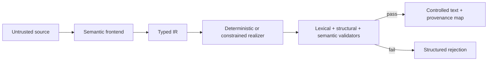

# ste-compiler

`ste-compiler` is an exploratory **STE-inspired** semantic-to-controlled-English compiler. It is not certified for, and does not claim compliance with, ASD-STE100. Its original MIT-licensed demonstration vocabulary is not the ASD-STE100 dictionary.

## Why compile language?

Direct prompting combines interpretation and wording in a probabilistic step, so negation, order, quantities, and terminology can drift. This prototype separates them:



The LLM frontend can only propose schema-validated IR with source spans. It cannot author production text. The deterministic realizer provides milestone one without a model or network. A LoRA can teach an SLM the task, but does not guarantee lexical or semantic constraints; validation and constrained output remain necessary.

Causal links are explicit IR nodes with claim-level provenance. The deterministic realizer emits
each link as two labeled controlled sentences (`Cause: ...` and `Effect: ...`), and semantic
validation checks their direction, endpoint mappings, feature snapshot, and exact surfaces
independently. Each relation pair is a separate paragraph so it cannot overflow the source
paragraph's sentence limit.

## Quick start

Requires Python 3.12+.

```bash
python -m pip install -e '.[dev,neural]'
ste-compiler demo --json
ste-compiler compile-source data/end_to_end/hydraulic_warning.txt \
  --ir-fixture data/end_to_end/hydraulic_warning.ir.yaml \
  --json
ste-compiler validate-ir data/examples/conditional.yaml
ste-compiler realize data/examples/sequence.yaml --metadata
ste-compiler plan-symbols data/examples/warning_pressure.yaml --json
ste-compiler export-symbolic-corpus data/examples --output training-corpus
ste-compiler build-demonstration-corpus --output demonstration-corpus
ste-compiler verify-demonstration-corpus demonstration-corpus
ste-compiler build-demonstration-corpus --version 2 --output demonstration-corpus-2
ste-compiler verify-demonstration-corpus demonstration-corpus-2
ste-compiler benchmark-report \
  data/benchmark/v1/benchmark-spec.json \
  data/benchmark/v1/failure-taxonomy.json \
  data/benchmark/v1/prediction-manifest.json \
  data/benchmark/v1/predictions.jsonl \
  datasets/demonstration-corpus-2 \
  --output benchmark-report
ste-compiler validate-training-config data/training/encoder-decoder-schema-example.yaml --json
ste-compiler verify-training-release \
  data/training/encoder-decoder-schema-example.yaml \
  datasets/demonstration-corpus-1 \
  --json
DECODER_SMOKE_ROOT="$(mktemp -d "${TMPDIR:-/tmp}/ste-compiler-decoder-smoke.XXXXXX")"
DECODER_SMOKE_MODEL="$DECODER_SMOKE_ROOT/model"
DECODER_SMOKE_RUN="$DECODER_SMOKE_ROOT/run"
MODEL_SNAPSHOT_MANIFEST_SHA256="$(
  ste-compiler prepare-decoder-smoke-fixture \
    data/training/decoder-only-lora-schema-example.yaml \
    datasets/demonstration-corpus-1 \
    "$DECODER_SMOKE_MODEL" \
    --json |
    python -c 'import json,sys; print(json.load(sys.stdin)["manifest_sha256"])'
)"
ste-compiler train-decoder-lora \
  data/training/decoder-only-lora-schema-example.yaml \
  datasets/demonstration-corpus-1 \
  "$DECODER_SMOKE_MODEL" \
  "$MODEL_SNAPSHOT_MANIFEST_SHA256" \
  "$DECODER_SMOKE_RUN" \
  --source-checkout .
ste-compiler compile data/examples/warning_pressure.yaml --json
ste-compiler validate-text data/examples/invalid_semantic.txt --ir data/examples/negative.yaml --json
ste-compiler glossary check data/demo_terminology.yaml
ste-compiler evaluate data/evaluation --output reports
pytest
```

`compile` rejects critical validation failures with a nonzero exit status. YAML uses `safe_load`, models reject unknown fields, no input is evaluated as code, and external providers are optional and inactive by default.

`demo` is the credential-free end-to-end reference workflow. It reads packaged raw source, replays
a checked-in gold IR proposal through the same schema and provenance boundary used by an LLM
frontend, verifies the complete source SHA-256 and every quoted source span against exact character
offsets, realizes controlled text, and runs the validators. Replay is deliberately identified as
`offline-replay`; it demonstrates the full compiler boundary without claiming that a model
extracted the gold IR. `compile-source` exposes the same workflow for an explicit raw-source and
IR-fixture pair.

`build-demonstration-corpus` reconstructs a licensed, frozen dataset release from packaged
construction inputs. Version 1 is the default wheel-bundled smoke sample; `--version 2` selects the
expanded benchmark-contract demonstration. `verify-demonstration-corpus` independently
reconstructs either release and requires byte-for-byte identity. See
[the corpus guide](docs/demonstration-corpus.md).

The optional `.[encoder-training]` extra supplies a deterministic offline CPU smoke trainer for a
pinned encoder-decoder model and tokenizer. It performs complete tokenizer and overflow preflight,
writes a safetensors-only atomic checkpoint plus a runtime-derived run manifest, and reloads the
checkpoint for validation-loss evaluation. The checked-in training configuration is a schema
example, not a selected public model or a runnable quality result. See the
[reproducible training guide](docs/training.md) for the command and artifact contract.
Both trainers also emit a canonical `artifact-manifest.json` that binds the complete output tree.
Retain the SHA-256 reported by training and use `ste-compiler preflight-artifact` to verify and
privately re-capture the exact bundle before publication or consumption.

`build-reference-release` assembles both trainer architectures into one small content-addressed
metadata release. It consumes the actual local loaders, records canonical prediction or rejection
JSONL and prediction hashes, writes exact model cards and license declarations, and leaves model
weights in separately identified external bundles. `verify-reference-release --regenerate`
requires the complete release to reproduce byte for byte. See the
[dual-architecture release guide](docs/reference-artifact-release.md). The checked-in
authorization example is only for repository-generated synthetic fixtures; no public base model,
hosting target, or quality claim is selected.

## Offline realizer selection

Strict `ste-realizer-config-v1` files select the deterministic, encoder-decoder, or decoder-only
LoRA path without turning inference into an implicit download. Hub variants identify artifacts
with full commit digests and run cache-only. Additive local-bundle variants identify complete
trainer outputs by externally retained SHA-256 while keeping their untrusted filesystem locators
outside the canonical configuration identity. The checked-in neural identities are illustrative
schema examples, not published project models or quality claims.

Pass a reviewed configuration to either IR compilation or the offline replay workflow:

```bash
ste-compiler compile \
  data/examples/warning_pressure.yaml \
  --realizer-config path/to/realizer.yaml \
  --json
ste-compiler compile-source \
  data/end_to_end/hydraulic_warning.txt \
  --ir-fixture data/end_to_end/hydraulic_warning.ir.yaml \
  --realizer-config path/to/realizer.yaml \
  --json
```

Omit `--realizer-config` to retain deterministic behavior. See the
[typed offline neural runtime guide](docs/neural-runtime.md) for the configuration and trust
boundary.

For a content-addressed encoder checkpoint, select
`encoder-decoder-local-bundle` and provide its locator separately:

```bash
ste-compiler compile data/examples/warning_pressure.yaml \
  --realizer-config data/realizers/encoder-decoder-local-bundle-schema-example.yaml \
  --artifact-bundle path/to/encoder-training-output \
  --json
```

The decoder local-bundle variant additionally requires the separately content-bound base snapshot:

```bash
ste-compiler compile data/examples/warning_pressure.yaml \
  --realizer-config data/realizers/decoder-only-lora-local-bundle-schema-example.yaml \
  --artifact-bundle path/to/decoder-training-output \
  --model-snapshot path/to/base-snapshot \
  --json
```

These variants are intentionally limited to `mechanics-smoke` artifacts. They demonstrate the full
offline loading boundary; they do not authorize an artifact, establish its license, or make a
quality claim. Explicit artifact fetching, published reference checkpoints, and benchmark results
remain later slices.

Local training outputs can be checked independently of runtime selection:

```bash
ste-compiler preflight-artifact path/to/training-output \
  --manifest-sha256 <sha256-reported-by-training> \
  --json
```

Preflight is offline and fail-closed. It requires an externally retained digest because trusting a
manifest found only beside the files would be self-attestation. Encoder checkpoints must reload
exactly through local-only, safetensors-only Transformers diagnostics; decoder runs must contain a
canonical, compatible PEFT adapter with complete paired LoRA matrices for every configured target
module. Preflight proves identity and loadability, not model quality, license authorization, or
suitability for deployment.

## Extension points

* **Vocabulary:** add an original/authorized entry to `data/demo_vocabulary.yaml`, including lemma, roles, meaning ID, inflections, example, and confusion notes. Keep its license explicit. Word forms must be unique under case folding and match the lexicalizer's single-word grammar. Unit surfaces must be stripped, nonblank, nonnumeric, and unique.
* **Terminology:** add a versioned term with canonical form, aliases, role, domain, provenance, approval status, and optional replacement. IDs must be unique. Canonical forms and aliases must be stripped, nonblank, nonnumeric, and uniquely owned under case folding. Deprecated replacements must exist and must not form cycles. `glossary check` reports these resource errors before realization; frontends resolve aliases and realizers copy canonical forms.
* **Neural realizer:** implement `SymbolGenerator`. `NeuralRealizer` sends it canonical IR and only the symbols present in the deterministic reference plan. Generated inference plans must begin with `PLAN_EXACT_WHITESPACE_V1`; markerless legacy lexicalization is never accepted at the neural trust boundary. Deterministic IR mappings are inherited only when the generated controlled text exactly equals the deterministic surface. `SymbolicLexicalizer` rejects out-of-plan symbols, and the independent aligner withholds IR mappings from changed, reordered, omitted, or extra sentences.
* **Encoder-decoder adapter:** configure `TransformersEncoderDecoderSymbolGenerator` with an explicit Hugging Face Hub repository ID and full lowercase 40-character model commit digest. Local filesystem model paths are rejected because mutable local contents cannot inherit immutable revision provenance. The exact commit is resolved once to a checked local snapshot; both tokenizer and model load only from that snapshot, and model revisions without safetensors weights fail closed. The adapter records the exact Hub digest, loads `.[neural]` lazily, constrains decoding to the current document's symbols plus EOS, permits only padding after EOS, and post-validates the decoded plan. The optional `.[encoder-training]` extra provides the corresponding safe two-step training smoke path. No trained checkpoint, measured training result, or model-quality benchmark result is included; the checked benchmark evidence is a deterministic reporting fixture only.
* **Training data:** use `plan-symbols --json` for one canonical `(serialized IR, symbolic plan)` record, or `export-symbolic-corpus` for stable path-ordered JSONL plus a SHA-256 manifest. Each export is stored in an immutable content-addressed directory under `training-corpus/generations/`; one atomic `training-corpus/current` selector exposes the canonical `current/corpus.jsonl` and `current/manifest.json` paths. Consumers that need a concurrency-safe pair should call `read_symbolic_corpus()`, which pins one generation before opening either artifact, rather than resolving the two `current` paths independently. Corpus export currently requires POSIX `fcntl` file locking; other CLI commands remain portable to platforms without `fcntl`. Duplicate document IDs, symlinked IR inputs, and metadata profiles that do not match the loaded deterministic realizer, vocabulary, terminology, and validation pipeline are rejected. Current plans start with `PLAN_EXACT_WHITESPACE_V1` and percent-encode observed approved word surfaces. Exact terminology symbols use `TERM_<escaped-id>|<escaped-observed-surface>`; the delimiter is encoded inside either field, preserving both stable identity and observed casing. Plans otherwise contain only `WORD_*`, `TERM_*`, `UNIT_*`, punctuation, `SPACE`/opaque whitespace, newline, and document-specific number symbols. Exact plans preserve casing without implicit sentence capitalization. Markerless legacy plans retain canonical term surfaces plus conventional spacing and capitalization.
* **LoRA/SLM:** install `.[neural]`. The decoder-only track includes a deterministic two-step offline CPU mechanics run with a generated tiny local causal model/tokenizer fixture, exact prompt masking plus one supervised EOS, atomic safetensors adapter output, runtime-derived provenance, and reload evaluation. It is not a trained reference model or quality result. A real experiment must pin and authorize its base revision and evaluate constrained and unconstrained variants separately.

The optional `DecoderOnlyLoRASymbolGenerator` is the concrete decoder-only inference boundary.
Configure it with Hub repository IDs and full lowercase 40-character commit digests for both the
base model and PEFT adapter; local paths, tags, branches, and abbreviated hashes are rejected. The
revision-qualified model ID and both exact digests are retained in realization metadata. It uses
lazy optional imports, disables remote model code, requires safetensors for both the base and
adapter, resolves the adapter to one checked local snapshot, and requires its LoRA `CAUSAL_LM`
configuration to name the exact configured base model revision. Generation explicitly neutralizes
inherited non-greedy and minimum-length modes so EOS remains available at valid symbol boundaries,
requires one batch of integer token IDs, and remains constrained to the document-specific symbol
set plus EOS. Pinning records identity; deployments must still authorize the selected artifact
repositories. This repository does not include trained reference weights, measured benchmark
results, or a model-quality claim. The generated training and benchmark fixtures exist only to
exercise mechanics and evidence plumbing.

General BPE token masking is insufficient: one word can span tokens, a token can contain leading whitespace or multiple characters, and different token paths can create the same unauthorized string. Symbol IDs followed by deterministic lexicalization make the allowed boundary inspectable. Technical terms similarly require controlled `TERM_*` copying, rather than hoping a model spells a multiword canonical form consistently.

See the [end-to-end demo](docs/end-to-end-demo.md),
[executable example catalog](docs/executable-examples.md),
[reproducible training guide](docs/training.md),
[benchmark evidence guide](docs/benchmark-evidence.md),
[release build provenance guide](docs/release-build-provenance.md),
[typed offline neural runtime guide](docs/neural-runtime.md),
[dual-architecture release guide](docs/reference-artifact-release.md),
[V1 implementation plan](docs/v1-implementation-plan.md),
[architecture](docs/architecture.md), [evaluation](docs/evaluation.md), and the ADRs for assumptions
and limitations. Project policies are in [CONTRIBUTING.md](CONTRIBUTING.md),
[SECURITY.md](SECURITY.md), the [code of conduct](CODE_OF_CONDUCT.md), and the
[release policy](docs/release-policy.md).
