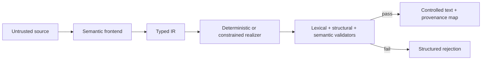

# ste-compiler

`ste-compiler` is an exploratory **STE-inspired** semantic-to-controlled-English compiler. It is not certified for, and does not claim compliance with, ASD-STE100. Its original MIT-licensed demonstration vocabulary is not the ASD-STE100 dictionary.

## Why compile language?

Direct prompting combines interpretation and wording in a probabilistic step, so negation, order, quantities, and terminology can drift. This prototype separates them:



The LLM frontend can only propose schema-validated IR with source spans. It cannot author production text. The deterministic realizer provides milestone one without a model or network. A LoRA can teach an SLM the task, but does not guarantee lexical or semantic constraints; validation and constrained output remain necessary.

## Quick start

Requires Python 3.12+.

```bash
python -m pip install -e '.[dev]'
ste-compiler validate-ir data/examples/conditional.yaml
ste-compiler realize data/examples/sequence.yaml --metadata
ste-compiler plan-symbols data/examples/warning_pressure.yaml --json
ste-compiler export-symbolic-corpus data/examples --output training-corpus
ste-compiler compile data/examples/warning_pressure.yaml --json
ste-compiler validate-text data/examples/invalid_semantic.txt --ir data/examples/negative.yaml --json
ste-compiler glossary check data/demo_terminology.yaml
ste-compiler evaluate data/evaluation --output reports
pytest
```

`compile` rejects critical validation failures with a nonzero exit status. YAML uses `safe_load`, models reject unknown fields, no input is evaluated as code, and external providers are optional and inactive by default.

## Extension points

* **Vocabulary:** add an original/authorized entry to `data/demo_vocabulary.yaml`, including lemma, roles, meaning ID, inflections, example, and confusion notes. Keep its license explicit. Word forms must be unique under case folding and match the lexicalizer's single-word grammar. Unit surfaces must be stripped, nonblank, nonnumeric, and unique.
* **Terminology:** add a versioned term with canonical form, aliases, role, domain, provenance, approval status, and optional replacement. IDs must be unique. Canonical forms and aliases must be stripped, nonblank, nonnumeric, and uniquely owned under case folding. Deprecated replacements must exist and must not form cycles. `glossary check` reports these resource errors before realization; frontends resolve aliases and realizers copy canonical forms.
* **Neural realizer:** implement `SymbolGenerator`. `NeuralRealizer` sends it canonical IR and only the symbols present in the deterministic reference plan. Generated inference plans must begin with `PLAN_EXACT_WHITESPACE_V1`; markerless legacy lexicalization is never accepted at the neural trust boundary. Deterministic IR mappings are inherited only when the generated controlled text exactly equals the deterministic surface. `SymbolicLexicalizer` rejects out-of-plan symbols, and the independent aligner withholds IR mappings from changed, reordered, omitted, or extra sentences.
* **Training data:** use `plan-symbols --json` for one canonical `(serialized IR, symbolic plan)` record, or `export-symbolic-corpus` for stable path-ordered JSONL plus a SHA-256 manifest. Each export is stored in an immutable content-addressed directory under `training-corpus/generations/`; one atomic `training-corpus/current` selector exposes the canonical `current/corpus.jsonl` and `current/manifest.json` paths. Consumers that need a concurrency-safe pair should call `read_symbolic_corpus()`, which pins one generation before opening either artifact, rather than resolving the two `current` paths independently. Corpus export currently requires POSIX `fcntl` file locking; other CLI commands remain portable to platforms without `fcntl`. Duplicate document IDs, symlinked IR inputs, and metadata profiles that do not match the loaded deterministic realizer, vocabulary, terminology, and validation pipeline are rejected. Current plans start with `PLAN_EXACT_WHITESPACE_V1` and percent-encode observed approved word surfaces. Exact terminology symbols use `TERM_<escaped-id>|<escaped-observed-surface>`; the delimiter is encoded inside either field, preserving both stable identity and observed casing. Plans otherwise contain only `WORD_*`, `TERM_*`, `UNIT_*`, punctuation, `SPACE`/opaque whitespace, newline, and document-specific number symbols. Exact plans preserve casing without implicit sentence capitalization. Markerless legacy plans retain canonical term surfaces plus conventional spacing and capitalization.
* **LoRA/SLM:** install `.[neural]`; train an adapter over the exported pairs. Record base model/revision, parameter count, adapter revision, seeds, data hash, hardware, and decoding profile. Evaluate constrained and unconstrained variants separately. A practical single-GPU experiment can use a small encoder-decoder model, or a compact decoder-only model with a LoRA adapter.

The optional `DecoderOnlyLoRASymbolGenerator` is the concrete decoder-only inference boundary.
Configure it with Hub repository IDs and full lowercase 40-character commit digests for both the
base model and PEFT adapter; local paths, tags, branches, and abbreviated hashes are rejected. The
revision-qualified model ID and both exact digests are retained in realization metadata. It uses
lazy optional imports, disables remote model code, requires safetensors for both the base and
adapter, resolves the adapter to one checked local snapshot, and requires its LoRA `CAUSAL_LM`
configuration to name the exact configured base model revision. Generation explicitly neutralizes
inherited non-greedy and minimum-length modes so EOS remains available at valid symbol boundaries,
requires one batch of integer token IDs, and remains constrained to the document-specific symbol
set plus EOS. Pinning records identity; deployments must still authorize the selected artifact
repositories. This repository does not include trained weights, training results, or a
model-quality claim.

General BPE token masking is insufficient: one word can span tokens, a token can contain leading whitespace or multiple characters, and different token paths can create the same unauthorized string. Symbol IDs followed by deterministic lexicalization make the allowed boundary inspectable. Technical terms similarly require controlled `TERM_*` copying, rather than hoping a model spells a multiword canonical form consistently.

See [architecture](docs/architecture.md), [evaluation](docs/evaluation.md), and the ADRs for assumptions and limitations.
